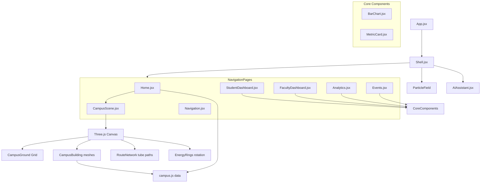

# Nexus University: Smart Campus Digital Twin Command Center

A futuristic, real-time 3D Smart Campus Digital Twin platform built with React, React Three Fiber (R3F), Tailwind CSS, Framer Motion, and Playwright. The platform visualizes space utilization, building metrics, routing, faculty operations, student timetables, and campus intelligence inside an interactive, premium command center interface.

---

## Table of Contents
1. [Overview](#overview)
2. [Project Architecture](#project-architecture)
3. [Directory Structure](#directory-structure)
4. [Core Features & Views](#core-features--views)
   - [3D Twin Control Panel](#3d-twin-control-panel)
   - [Campus Route Finder](#campus-route-finder)
   - [Student Command Center](#student-command-center)
   - [Faculty Operations](#faculty-operations)
   - [Live Intelligence & Analytics](#live-intelligence--analytics)
   - [Events Hub](#events-hub)
   - [AI Assistant](#ai-assistant)
5. [Technical Implementation Details](#technical-implementation-details)
   - [Three.js & React Three Fiber (R3F) Canvas](#threejs--react-three-fiber-r3f-canvas)
   - [Animations & Easing (Framer Motion & RequestAnimationFrame)](#animations--easing-framer-motion--requestanimationframe)
   - [Styling & Design Tokens (Tailwind & Glassmorphism)](#styling--design-tokens-tailwind--glassmorphism)
6. [Development & Building](#development--building)
7. [Verification & Testing](#verification--testing)

---

## Overview

The **Nexus University Smart Campus Digital Twin** acts as a centralized spatial command dashboard. It is designed to provide real-time visibility into the campus ecosystem, enabling administrators, students, and faculty to:
* **Interact in 3D** with a floating schematic of the campus layout.
* **Observe real-time occupancy and energy consumption** across individual research labs and classrooms.
* **Navigate indoor spaces** by query or location list.
* **Monitor academic progress** and coordinate events through distinct dashboards.
* **Interact with a conversational AI** to generate smart routing or get schedules.

---

## Project Architecture

The application is structured as a modern single-page React app bundled with Vite.



* **Core Engine**: React 18 & React Router Dom v6
* **3D Visuals**: Three.js mapped through `@react-three/fiber` and `@react-three/drei`
* **Animations**: `framer-motion` for page slides and interactive HUD bars, and `requestAnimationFrame` for custom hooks
* **CSS System**: Tailwind CSS v3 with custom gradient overlays and glassmorphism styles in `src/styles.css`
* **Icons**: `lucide-react`

---

## Directory Structure

Here is an overview of the key codebase directories and files:

```
smart-campus-digital-twin-project/
├── index.html                  # HTML entry point (contains SEO description & theme color)
├── package.json                # Project script commands & dependency configurations
├── tailwind.config.js          # Extended color system, custom typography, glows, and animations
├── vite.config.js              # Vite bundler options with React support
├── src/
│   ├── main.jsx                # React app bootstrapping
│   ├── App.jsx                 # Route manager with AnimatePresence page transitions
│   ├── styles.css              # Custom Tailwind classes, glassmorphism layers, and neon border clip-masks
│   ├── components/
│   │   ├── AIAssistant.jsx     # Floating chat bot panel with mic/send capabilities
│   │   ├── PageTransition.jsx  # Framer Motion wrapper for page entries
│   │   ├── dashboard/
│   │   │   ├── BarChart.jsx    # Custom animated bar chart for building/dept occupancy
│   │   │   └── MetricCard.jsx  # Animated KPI indicator cards
│   │   ├── layout/
│   │   │   └── Shell.jsx       # Layout containing header, navigation nodes, floating particles, and footer
│   │   └── three/
│   │       └── CampusScene.jsx # Full R3F Canvas representing buildings, routes, fog, and day/night toggles
│   ├── data/
│   │   └── campus.js           # Central mock data model for buildings, schedules, and analytics
│   └── hooks/
│       └── useCounter.js       # requestAnimationFrame custom easing counter hook
└── work/
    └── verify-site.cjs         # Playwright script verifying viewport screenshots & JavaScript error logs
```

---

## Core Features & Views

### 1. 3D Twin Control Panel (`/`)
* **3D Interactive Scene**: Highlights buildings dynamically.
* **Building Selection HUD**: Selecting a building reveals structural details (number of floors, occupancy rate, energy footprints).
* **Day/Night Toggle**: Modulates scene illumination, adds/removes background star clusters (`<Stars />` from Drei), shifts ambient and fog levels.
* **Real-time Count HUD**: Displays key metrics with count-up animations on load.

### 2. Campus Route Finder (`/navigation`)
* **Search Node**: Filters location spaces such as "AI Lab 402", "Quantum Clean Room", or "Canteen Sky Deck".
* **Indoor Navigation Routing**: Selects a starting origin point (Main Gate, Student Parking, Metro Bridge) and displays simulated navigation routes.
* **Grid Index**: Displays cards representing active building data with real-time occupancy meters.

### 3. Student Command Center (`/student`)
* **Key KPI Metas**: Attendance tracking (92%), daily class load count, open assignment flags, and academic performance index (8.7).
* **Class Timetable List**: Chronological display of upcoming classes with preparation percentages.
* **Academic Performance Chart**: Custom animated bar chart comparing grades across core courses.

### 4. Faculty Operations (`/faculty`)
* **Faculty Insights**: Tracks pending attendance checks, high-risk flags, events created, and department average learning velocities.
* **Attendance marking**: Interface components that simulate marking, reviewing, and notifying class groups.
* **Department Statistics**: Bar charts and metric modules displaying data from engineering, design, business, and science fields.

### 5. Live Intelligence & Analytics (`/analytics`)
* **Sensors HUD**: Displays overall details on live sensors (1,280 online), active route requests, and average occupancy.
* **Live Heatmap**: Visualizes user traffic density across campus grids.
* **Department Performance Matrix**: Cards analyzing spatial load efficiency by department.

### 6. Events Hub (`/events`)
* **Upcoming Registry**: Dynamic index listing expos, coding sprints, and fireside talks.
* **Interactive Registry Button**: Lets users sign up for specific events.
* **Event Asset Gallery**: Generates linear gradient previews representing historical event photographs and projects.

### 7. AI Assistant
* **Persistent Button**: A floating bot widget present in the bottom-right corner of the application layout.
* **Interactive Conversation**: Allows users to chat with the assistant. Supports quick-chip suggestions (e.g. *Route to AI Lab*, *Today events*, *Library occupancy*).

---

## Technical Implementation Details

### Three.js & React Three Fiber (R3F) Canvas
The centerpiece 3D display ([CampusScene.jsx](file:///c:/Users/user/Desktop/smart-campus-digital-twin-project/src/components/three/CampusScene.jsx)) showcases several spatial geometries:
1. **Fog & Lighting**: A dynamic fog matches the background colors `#071229` (Day) or `#030611` (Night). Ambient lights drop from `0.58` to `0.32` and directional light tones shift to a bluish color (`#8bbdff`) at night.
2. **OrbitControls**: Constrains user pan/zoom bounds (`minDistance={5}`, `maxDistance={15}`, and `maxPolarAngle={Math.PI / 2.18}`) to maintain a fixed bird's-eye view.
3. **Animated Floating Buildings**: Meshes represent structural towers and float using a cosine wave displacement algorithm:
   ```javascript
   useFrame((state) => {
     group.current.position.y = Math.sin(state.clock.elapsedTime * 1.8 + building.x) * 0.035;
   });
   ```
4. **Interactive Html Tooltips**: `<Html />` from `@react-three/drei` dynamically mounts a HTML tooltip above any building hovered over or selected by the user.
5. **Route Networks**: Connected line paths between buildings are rendered as custom 3D tubes (`TubeGeometry`) using a `CatmullRomCurve3`.
6. **Energy Rings**: Spinning concentric vectors rendered at the map origin representing power levels:
   ```javascript
   useFrame((state) => {
     ref.current.rotation.z = state.clock.elapsedTime * 0.28;
   });
   ```

### Animations & Easing
* **Animated counters** are managed using a custom `useCounter` hook. To ensure smooth transitions, it updates the state based on cubic easing equations over a `1300ms` window.
* **Bar progress charts** and **Metric cards** animate into view using Framer Motion's `whileInView` and `viewport` triggers.
* **Page transitions** slide up and fade out using a synchronized routing hook inside [App.jsx](file:///c:/Users/user/Desktop/smart-campus-digital-twin-project/src/App.jsx) wrapped inside `<AnimatePresence mode="wait">`.

### Styling & Design Tokens
* **Colors**:
  * Deep void background: `#050816`
  * Cyber cyan primary: `#00E5FF`
  * Cyber violet secondary: `#7B61FF`
  * Emerald accent: `#00FFB3`
* **Glassmorphism**: Defined using custom utility styles `.glass` and `.glass-dark` featuring `backdrop-filter: blur()`, semi-transparent borders (`rgba(255,255,255,0.12)`), and drop shadows.
* **Neon Borders**: Implemented via custom clipping masks using CSS `mask-composite: exclude` to paint borders with gradient tracks.

---

## Development & Building

To run the application locally or build it for production, utilize the standard Node package manager (npm) commands:

### Start Development Server
```bash
npm run dev
```
Starts Vite dev server pointing to `http://127.0.0.1:5173/`.

### Compile Production Build
```bash
npm run build
```
Creates production-ready compiled code packages in the `dist` directory.

### Preview Production Build
```bash
npm run preview
```
Serves the locally built files to preview the release environment.

---

## Verification & Testing

The project is integrated with an automated check system ([verify-site.cjs](file:///c:/Users/user/Desktop/smart-campus-digital-twin-project/work/verify-site.cjs)) using **Playwright**:
1. Checks that the application boots on both **desktop** (1440x1000) and **mobile** (390x844) viewports.
2. Asserts that the `<canvas>` element loads successfully.
3. Takes screenshots of the home dashboard and stores them under the `outputs/` folder.
4. Crawls all pages (`/navigation`, `/student`, `/faculty`, `/analytics`, `/events`) to assert header structures and verify there are no javascript console error logs.
